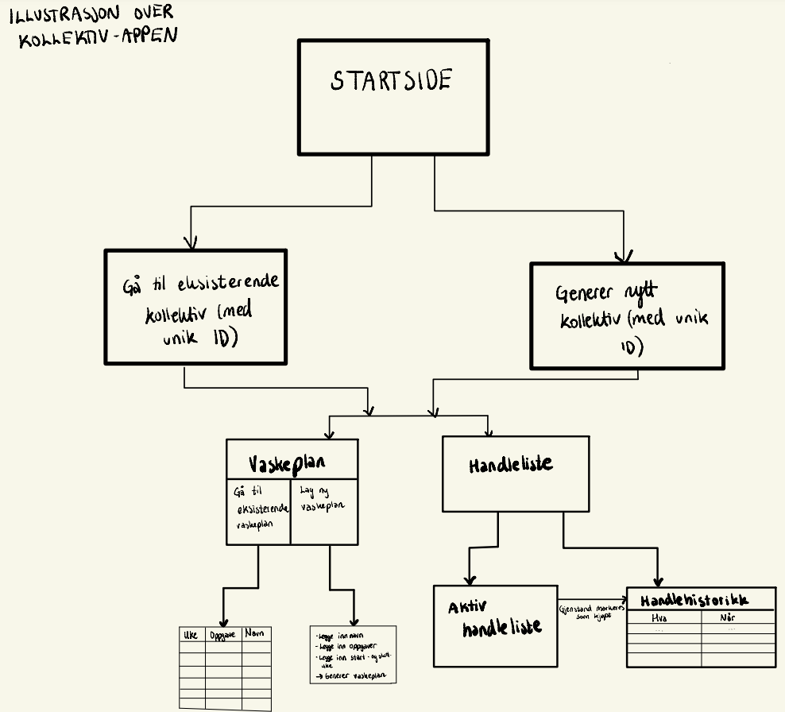

# Beskrivelse av prosjektet

Denne appen gjør det enkelt for beboere i et kollektiv å holde oversikt over både vaskelister og innkjøpslister. Beboerne får en god oversikt over rengjøringsoppgavene, samtidig som de kan være sikre på at nødvendige varer alltid er på plass. Når et nytt kollektiv opprettes, genereres en unik kollektiv-ID som kan brukes til å enten starte et nytt kollektiv eller bli med i et eksisterende.

For eksempel kan man lage en vaskeliste ved å sette opp hvilke rom som trenger å rengjøres, som bad, stue eller kjøkken, og fordele oppgavene mellom beboerne ved å legge til navnene deres. Vaskelistene blir automatisk oppdatert og rullert, slik at alle i kollektivet bidrar jevnt til husarbeidet. Appen har også en praktisk innkjøpsliste hvor alle i kollektivet kan legge inn ting som trengs, enten det er mat, rengjøringsmidler eller andre husholdningsvarer. Når noe er kjøpt inn, kan det enkelt krysses av listen. På denne måten blir alle holdt oppdatert og kan bidra til både innkjøp og rengjøring, noe som gjør hverdagen i kollektivet mye smidigere og mer effektiv.

# Flytdiagram

Vedlagt er et flytdiagram av de forskjellige tilstandene en bruker vil møte. Først vil alle bruker komme til en startside hvor de får spørsmål om å opprette et nytt kollektiv, eller bli med i et eksisterende kollektiv. I dette tilfellet vil vi bli med i et eksisterende kollektiv, da skriver vi inn en kode som sender brukeren til valget mellom å sjekke vaskelisten eller redigere/sjekke innkjøpslisten.

 

# Brukerhistorie

En brukerhistorie som beskriver tre forskjellige brukstilfeller av applikasjonen:

