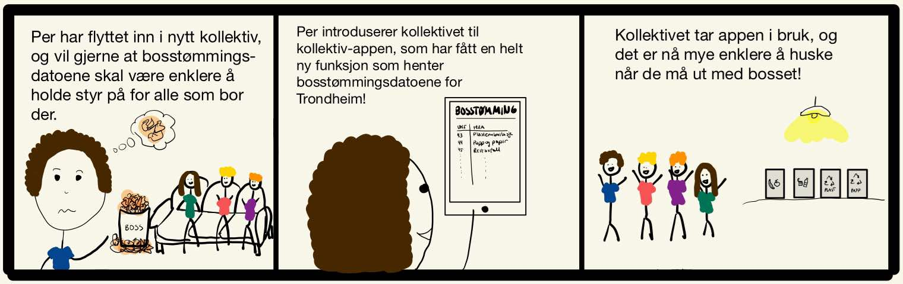
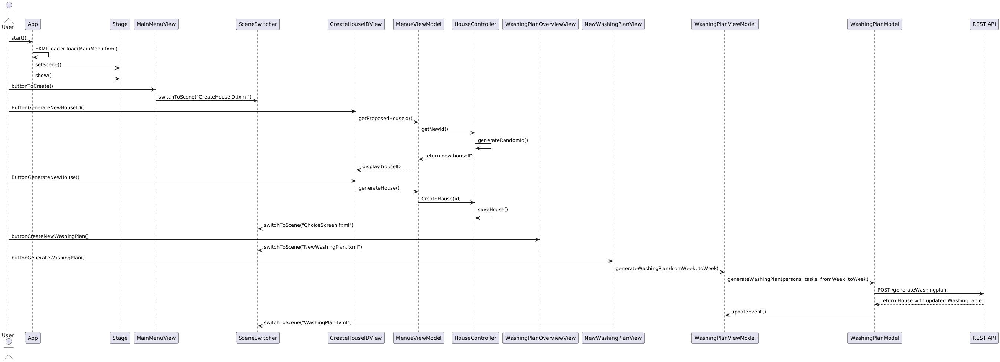

# Beskrivelse av prosjektet (release 3)
Denne applikasjonen gjør det enkelt for beboere i et kollektiv å holde oversikt over både vaskeplaner, innkjøpslister og tømmeplan for søppel. Beboerne får en god oversikt over rengjøringsoppgavene og bosshentingsdatoer, samtidig som de kan være sikre på at nødvendige varer alltid er på plass. Når et nytt kollektiv opprettes, genereres en unik kollektiv-ID som kan brukes til å enten opprette et nytt kollektiv i appen. Denne IDen kan senere benyttes til å logge inn i det eksisterende kollektivet.

Vaskeplanfunksjonen gjør at kollektivet kan opprette en egen vaskeplan hvor man kan legge inn navn og ukentlige gjøremål, og automatisk generere en vaskeplan for ønskede uker. Navnene i vaskeplanen roteres automatisk mellom gjøremålene hver uke. Det er også mulig å redigere vaskeplanen, samt å lage en helt ny som erstatter den gamle.

Handlelistefunksjonen består av en aktiv handleliste, samt en handlehistorikk. I den aktive handlelisten kan alle legge til varenavn og -antall av det som må kjøpes, og enten slette eller markere som kjøpt de varene som ikke lenger skal stå på listen. Dersom varen markeres som kjøpt havner den automatisk i handlehistorikken, hvor varenavn og handledato står, slik at man enkelt kan sjekke når en vare sist ble handlet om man er på butikken og er usikker på om man skal kjøpe en vare til kollektivet.

Den nye funksjonaliteten som ble lagt til i release3 implementerer en bosstømmingsplan, som viser hvilke uker ulike avfallstyper skal tømmes. Tømmeplanen hentes dynamisk fra Trondheim Renholdsverk sin nettside ved hjelp av web-scraping, noe som sikrer at planen alltid er oppdatert dersom det skjer endringer på nettsiden.

## REST-tjenesten

- Dokumentasjon av REST-tjenesten, altså (format for) forespørslene som støttes.

## Refleksjon rundt implisitt lagring (krav fra øving 2)

I dette prosjektet benyttes implisitt lagring istedenfor dokumentmetafor, da dette er mest gunstig med tanke på brukeropplevelsen og appens funksjon. I forhold til en dokumentmetafor, hvor brukeren er direkte involvert med lagring av filene sine, gjør dette applikasjonen mer brukervennlig, da bruker slippet å bekymre seg for tap av data om en glemmer å trykke på en "lagre"-knapp og annen filhåndtering. All data som lagres er knyttet til en kollektiv-ID, og lagres automatisk i en JSON-fil, og er sikret kontinuerlig synkronisering og konsistens ved slik automatisk lagring. Det bør dog merkes at det finnes noen ulemper med denne løsninger, for eksempel mangel på versjonshåndtering og mindre kontroll for brukeren på hva som lagres hvor og når. Gruppen ser likevel at implisitt lagring gir best brukeropplevelse i forhold til applikajsonens bruksområde og tenkt brukermåte.

## Brukerhistorie

En brukerhistorie som beskriver den nye boss-funksjonen aiv applikasjonen:

## Arkitekur og diagrammer

Vi har laget tre diagrammer som beskriver arkitekturen og strukturen i prosjektet med forskjellige mengde abstraksjon. 

### Pakkediagram

Pakkediagrammet viser hvordan pakkene og modulene i prosjektet kommuniserer med hverandre. Datapakken er et bibliotek for klasser som trengs av flere andre pakker samtidig.
- Selve pakkediagrammet

### Klassediagram

Klassediagrammet viser de viktisgte klassene i systemet og hvordan de er koblet sammen. For å gjøre diagrammet mer oversiktlig har vi valgt å se bort ifra data pakken.
- Selve klassediagrammet

### Sekvensdiagram

Sekvensdiagrammet viser koblingen mellom brukerinteraksjon og det som skjer inni systemet for et viktig brukstilfellet. Brukstilfellet er når bruker oppretter et nytt kollektiv med tilhørende ID, og videre oppretter en ny vaskeplan i applikasjonen.

