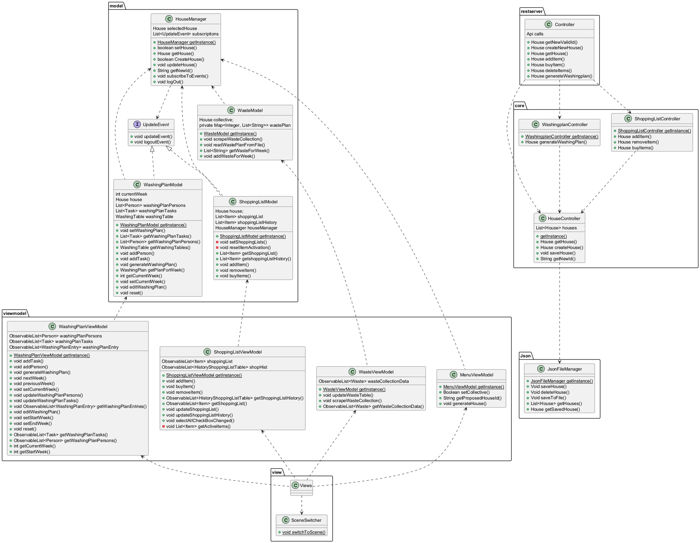
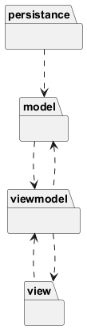
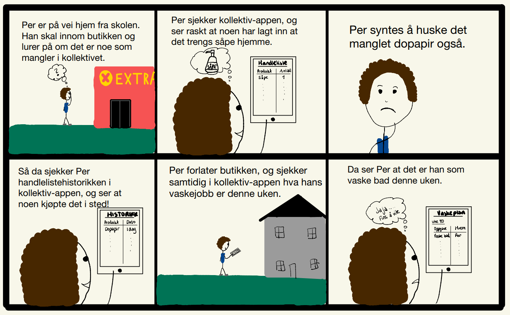

# Beskrivelse av prosjektet (release 3)
Denne applikasjonen gjør det enkelt for beboere i et kollektiv å holde oversikt over både vaskeplaner, innkjøpslister og tømmeplan for søppel. Beboerne får en god oversikt over rengjøringsoppgavene og bosshentingsdatoer, samtidig som de kan være sikre på at nødvendige varer alltid er på plass. Når et nytt kollektiv opprettes, genereres en unik kollektiv-ID som kan brukes til å opprette et nytt kollektiv i appen. Denne IDen kan senere benyttes til å logge inn i det eksisterende kollektivet.

Vaskeplanfunksjonen gjør at kollektivet kan opprette en egen vaskeplan hvor man kan legge inn navn og ukentlige gjøremål, og automatisk generere en vaskeplan for ønskede uker. Navnene i vaskeplanen roteres automatisk mellom gjøremålene hver uke. Det er også mulig å redigere vaskeplanen, samt å lage en helt ny som erstatter den gamle.

Handlelistefunksjonen består av en aktiv handleliste, samt en handlehistorikk. I den aktive handlelisten kan alle legge til varenavn og -antall av det som må kjøpes, og enten slette eller markere som kjøpt de varene som ikke lenger skal stå på listen. Dersom varen markeres som kjøpt havner den automatisk i handlehistorikken, hvor varenavn og handledato står, slik at man enkelt kan sjekke når en vare sist ble handlet om man er på butikken og er usikker på om man skal kjøpe en vare til kollektivet.

Den nye funksjonaliteten som ble lagt til i release3 implementerer en bosstømmingsplan, som viser hvilke uker ulike avfallstyper skal tømmes. Tømmeplanen hentes dynamisk fra Trondheim Renholdsverk sin nettside ved hjelp av web-scraping, noe som sikrer at planen alltid er oppdatert dersom det skjer endringer på nettsiden.

## REST-tjenesten

REST APIet støtter følgende formater: GET- og POST-forespørsler med JSON som input- og output-format. Objektene blir automatisk omgjort til JSON, slik at det ikke trengs ekstra logikk for serialisering eller deserialisering av data. Dette gjør at REST-API-et enkelt kan kommunisere med frontend eller andre tjenester uten behov for tilleggsimplementering.

## Refleksjon rundt implisitt lagring (krav fra øving 2)

I dette prosjektet benyttes implisitt lagring istedenfor dokumentmetafor, da dette er mest gunstig med tanke på brukeropplevelsen og appens funksjon. I forhold til en dokumentmetafor, hvor brukeren er direkte involvert med lagring av filene sine, gjør dette applikasjonen mer brukervennlig, da bruker slippet å bekymre seg for tap av data om en glemmer å trykke på en "lagre"-knapp og annen filhåndtering. All data som lagres er knyttet til en kollektiv-ID, og lagres automatisk i en JSON-fil, og er sikret kontinuerlig synkronisering og konsistens ved slik automatisk lagring. Det bør dog merkes at det finnes noen ulemper med denne løsninger, for eksempel mangel på versjonshåndtering og mindre kontroll for brukeren på hva som lagres hvor og når. Gruppen ser likevel at implisitt lagring gir best brukeropplevelse i forhold til applikajsonens bruksområde og tenkt brukermåte.

## Arbeidsflyt

Vi har brukt scrum for å sikre en oversiktlig og profesjonell arbeidsflyt. Gjennom ukentlige planleggingsmøter, arbeid både individuelt og i workshops, samt jevnlige oppdateringer om fremdrift og eventuelle utfordringer, har vi oppnådd et svært godt samarbeid som team. 
Scrum-metoden har gitt oss en lav terskel for å diskutere og løse problemer sammen, og har gjort det mulig med kontinuerlig forbedring av prosjektet. Arbeidsmetoden har vært strukturert og effektiv, noe som har ført til gode resultater. 

Vi har hatt en god inndeling i mindre oppgaver og issues, alle rettet mot Øving 2-milepælen. For å bestemme prioriteringen av hvilke oppgaver vi måtte løse først, begynte vi med den grunnleggende elementene, som for eksempel å lage førsteutkast for alle javafxml-filene. Deretter fokuserte vi på å generere og implementere selve logikken i view og model. Prioriteringen og arbeidsfordelingen avtalte vi på de ukentilige planleggingsmøtene våres på mandager. 

Vi har hatt ukentlige workshops på onsdager hvor vi har jobbet intensivt sammen for å få utført så mye som mulig. Etter workshopene og resten av uken jobbet vi individuelt hjemmefra, med jevnlig kontakt med resten av gruppen. For å sikre effektiv fremdrift, satte vi flere interne tidsfrister, som ga oss et klart mål for når oppgavene burde være fullført.

Tidlig i prosessen la vi et pipline-system for å kvalitetssikre koden før den ble lagt til. Vi har også vært flinke til å se over hverandres kode før den blir merget. Dette har ført til at koden som blir merget har høy kvalitet og vi har unngått uønskede komplikasjoner.

Arbeidet organiseres i hovedsak etter issues teamet setter opp sammen, hvor issuesene er koblet til en milepæl. Milepælene vi har satt opp er de ulike innleveringene som må gjøres. Når en jobber med et issue, lages en branch som er koblet til issuen, noe som gjør det veldig enkelt å ha oversikt og følge med på arbeidet som gjøres. Når et issue er ferdig, lukkes det, og branchen merges inn i Dev, før Dev til slutt merges inn i master-branchen før innlevering.

Når det kommer til review og testing, følger teamet praksiser som sikrer at koden til enhver tid kompilerer og at kodekvaliteten er god. Merge requests blir sett nøye over av flere teammedlemmer, og alle passer på at koden kompilerer og kjører som ønsket før koden pushes. Tester legges til etterhvert som koden skrives, og det blir forsøkt å dekke så mye som mulig av koden. 

## Arbeidsvaner

Teamet har som nevnt fulgt en fast ukentlig rutine med mandags- og onsdagsmøter på faste tidspunkter. Hvert møte starter med en standup hvor hvert teammedlem forteller i korte trekk hva de har gjort siden sist, og nevner eventuelle utfordringer de har støtt på. Etter denne gjennomgangen tar teamet tak i spesifikke problemer, løser dem sammen, og blir enige om planen for resten av møtet. For å unngå at denne planleggingen tar for mye av tiden til planlagte arbeidsøkter, er mandagsmøtet dedikert til dette. Under mandagsmøtene diskuterer vi kravene til neste innlevering, og hvordan vi best mulig kan obbe frem mot innleveringsfristen. Hvert teammedlem får delegert oppgaver basert på ønsker eller kompetanse, og så bruker teamet god tid på å være enige i konkret hva som skal gjøres, og hvordan. Frem til onsdagsmøtet er det dermed muligheter til å begynne med sin delegerte oppgave. 

Onsdagsmøtet er en ren arbeidsøkt, hvor vi begynner med en kort standup, og deretter bruker mesteparten av tiden til prosjektarbeid. Som en del av onsdagsøktene har vi gjort det til en vane å spise et måltid sammen. Dette hjelper oss med å holde motivasjonen oppe, styrker teamfølelsen, og gir oss en pause til å koble av litt midt i arbeidet. På slutten av onsdagsmøtet setter vi alltid interne frister, vanligvis til et av møtene neste uke, slik at vi er sikre på at vi er i rute og oppholder en jevn fremdrift. Større oppgaver som er vanskelig å dele opp, delegeres til to personer, som da organsierer egne arbeidsøkter hvor de parprogrammerer. 

Under hele denne prosessen er vi nesten daglig i kontakt i gruppechatten der vi deler spørsmål, oppdateringer og forslag. Vi har også lagt stor vekt på å bruke tydelige commit-meldinger for å sikre at alle har oversikt over prosjektets fremgang. I tillegg oppfordres det til å ha lav terskel for å be om hjelp, slik at ingen blir sittende fast for lenge med problemer som andre kanskje kan løse raskt. På denne måten sørger vi for at alle er oppdatert og at teamet jobber mest mulig effektivt.

## Kodekvalitet - Bruk av kvalitetsverktøy

I dette prosjektet har vi implementert en rekke verktøy for å opprettholde høy kodekvalitet. Disse verktøyene hjelper oss med å sikre at koden er robust, godt strukturert, og lett å vedlikeholde. Under har vi nevnt hvilke verktøy vi har brukt i utviklingsprossesen.

### CI Pipeline
Vi har satt opp en CI-pipeline i GitLab som automatiserer kjøring av enhets- og integrasjonstester, kompilering, bygging og initialisering av prosjektet i en Docker-kontainer på en separat server. Denne prosessen sikrer at systemet fungerer som forventet før koden merges med andre grener. CI-Pipeline flagger også kode som ikke passerer tester eller som ikke kan kjøres korrekt. Et av hovedformålene med CI-pipeline er å sikre at koden initialiserer alle lokale variabler korrekt.

Mot slutten av prosjektet måtte vi bytte Docker-image i siste liten, siden det gamle imaget ikke funket med avhengighetene for Shippable-produktet. Vi klarte å få imaget til å kjøre, men på grunn av høy trafikk på NTNUs servere rett før leveringsfrist fikk vi dessverre ikke muligheten til å teste det i pipelinen. Frem til denne endringen ble alle enhets- og integrasjonstester kjørt automatisk i pipelinen. Til tross for utfordringene har CI-pipelinen vært en viktig kilde til verdifull feilsøkingsinformasjon gjennom hele prosjektet, og den har bidratt vesentlig til kvaliteten på sluttresultatet – både før og etter teststeget ble fjernet.

### Testdekning med Jacoco
For å sikre at all kode blir tilstrekkelig testet, har vi brukt Jacoco til å måle testdekning. Jacoco kjøres automatisk hver gang vi utfører mvn clean install, og gir oss innsikt i hvor stor del av koden som er dekket av tester. Dette hjelper oss med å identifisere hvilke deler av applikasjonen som eventuelt mangler tester.

### Syntaxfeil med Checkstyle
For å sikre en konsekvent kodestruktur og stil har vi brukt Checkstyle. Dette verktøyet genererer rapporter om avvik i kodekonvensjoner og syntaksfeil som, selv om de ikke nødvendigvis påvirker kjørbarheten, kan gjøre koden mindre lesbar. 

### Bug mønstere med SpotBugs
SpotBugs er brukt for å identifisere potensielle feil og mønstre som kan føre til uønsket oppførsel, som uendelige løkker eller ressurshåndteringsfeil. Sammen med Checkstyle bidrar SpotBugs til å sikre høy kvalitet på både logikken, strukturen og språkbruken i koden vår.

### Teststrategi 
I prosjektet vårt har vi en enkel teststrategi som dekker enhetstester, integrasjonstester og UI-tester. Vi bruker TestFX for å simulere brukerinteraksjoner i JavaFX-applikasjonen. Enhetstester tar seg av backend-logikken, mens integrasjonstester sikrer at modulene samarbeider som de skal. Dette hjelper oss med å fange opp feil tidlig.

### Oppsummering av testing
Alle verktøyene våre spiller sammen for å sikre høy kodekvalitet. Testene forbedrer dekningsgraden i CI-pipelinen, som automatisk sikrer at prosjektet bygger og kjører. Jacoco gir oversikt over testdekning, mens SpotBugs og Checkstyle hjelper oss med å identifisere bugs og kodekonvensjoner vi må forbedre. Dette gir oss mulighet til å iterativt forbedre koden, samt alltid levere kode av høy kvalitet.

## Arkitekur og diagrammer

Vi har laget tre diagrammer som beskriver arkitekturen og strukturen i prosjektet med forskjellige på forskjellig abstraksjonsnivå. 

### Pakkediagram

Pakkediagrammet viser hvordan pakkene og modulene i prosjektet kommuniserer med hverandre. Datapakken er et bibliotek for klasser som trengs av flere andre pakker samtidig. Vi har valgt å inkludere persistence i core-komponenten fordi vi valgte å holde persistence-mappen enkel og anså det som unødvendig å opprette en egen modul for denne funksjonaliteten.

### Klassediagram

Klassediagrammet viser de viktisgte klassene i systemet og hvordan de er koblet sammen. For å gjøre diagrammet mer oversiktlig har vi valgt å se bort ifra datapakken som inneholder dataklasser som alle modulene arver.

### Sekvensdiagram

Sekvensdiagrammet viser koblingen mellom brukerinteraksjon og det som skjer inni systemet for et viktig brukstilfellet. Brukstilfellet er når bruker oppretter et nytt kollektiv med tilhørende ID, og videre oppretter en ny vaskeplan i applikasjonen.

### Model-View-ViewModel (MVVM) logical view

 Først har vi et enkelt diagram som beskriver flyt av data og ansvar over logikk i prosjektet. View har ansvar for brukergrensesnitt og vising av data. Viewmodel er et mellomlag som forbereder data mellom view og model. Model Inneholder logikken til applikasjonen og persistance har ansvar for lagring. Vi har valgt å inkludere persistence i core-komponenten fordi vi valgte å holde persistence-mappen enkel og anså det som unødvendig å opprette en egen modul for denne funksjonaliteten.

## Brukerhistorie
Brukerhistorie for vaskeplan- og handlelistefunksjonene:

En brukerhistorie som beskriver den nye boss-funksjonen i applikasjonen:

