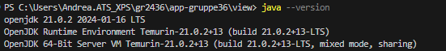
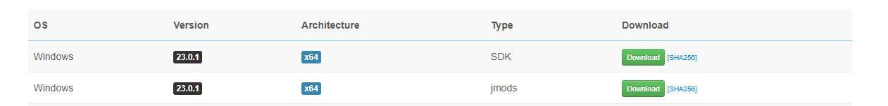
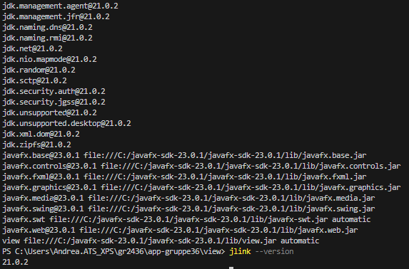
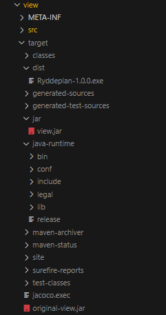
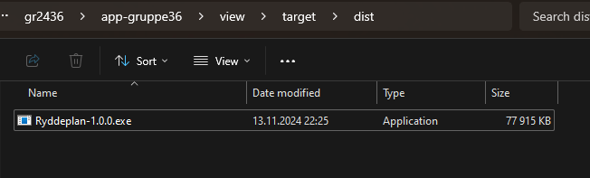
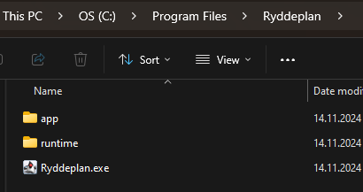
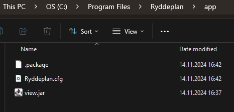
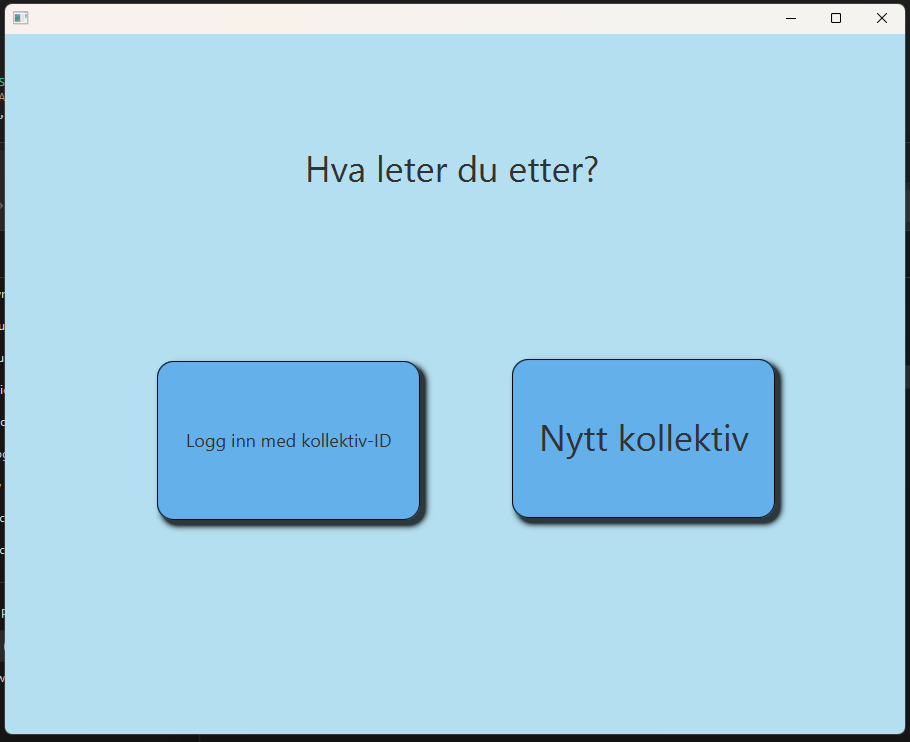
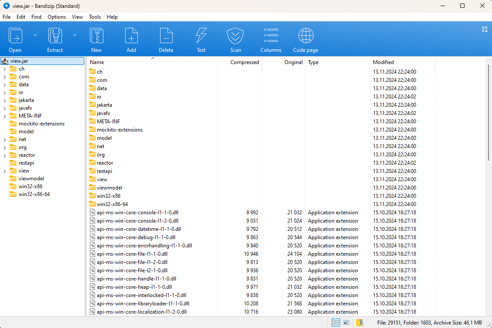
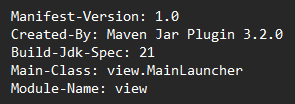

# Shippable produkt

Vi har brukt jlink og jpackage til å generere en Java-runtime og en kjørbar fil, Ryddeplan.exe, som gjør det enkelt å installere appen lokalt på PC-en og dele den. Metoden er testet på Windows OS, og nedenfor finner du en trinnvis veiledning med bilder som forklarer prosessen.

## Viktige installasjoner og versjoner for at metoden skal fungere
- WiX Toolset versjon 3.14
- JavaFX SDK versjon 23.0.1

Metoden er kun testet på følgende Java-versjoner: 21.0.1, 21.0.2, 21.0.3 og 21.0.4

## Installasjon av JavaFX SDK

JavaFX SDK ble lastet ned fra Gluon: https://gluonhq.com/products/javafx/

Filene ble lastet ned, pakket ut kopier fil siten til %din plassering%/javafx-sdk-23.0.1/lib

Videre vil vi referere til denne lenken som %PATH_TO_FX%

Et eksempel på denne er %PATH_TO_FX% = C:\javafx-sdk-23.0.1\lib

## Fremgangsmåte
Naviger deg til prosjektet og bruk følgende kommandoer:

- cd app-gruppe36

- mvn clean install

- cd view

For å få Java-runtime-mappen inn i target-mappen bruk følgende kommando:

- jlink --module-path "%PATH_TO_FX%;target/jar/view.jar" --add-modules javafx.controls,javafx.fxml,javafx.base,javafx.graphics --output target/java-runtime

### NB!
%PATH_TO_FX% i kommandoen over må byttes ut med din plassering av /javafx-sdk-23.0.1/lib

- javac --module-path "%PATH_TO_FX%" --add-modules javafx.controls,javafx.fxml,javafx.base,javafx.graphics src\main\java\view\App.java

For å få en dist mappe i target som inneholder Ryddeplan-1.0.0.exe:

- jpackage --name Ryddeplan --app-version 1.0.0 --input target/jar --main-jar view.jar --main-class view.MainLauncher --dest target/dist --runtime-image target/java-runtime

Nedenfor er et bilde av hvordan target-mappen til view skal se ut:

### Sende eller installere appen

1. Åpne dist-mappen i file explorer

2. Åpne Ryddeplan-1.0.0.exe

3. Åpne C:\Program Files\Ryddeplan\app

4. Åpne view.jar filen (appen)

### Innhold i view.jar
View.jar inneholder alle mappene og filene den trenger for å kjøre

Ser at Main-Class og versjonene stemmer for view.jar, utklipp fra MANIFEST.MF filen

