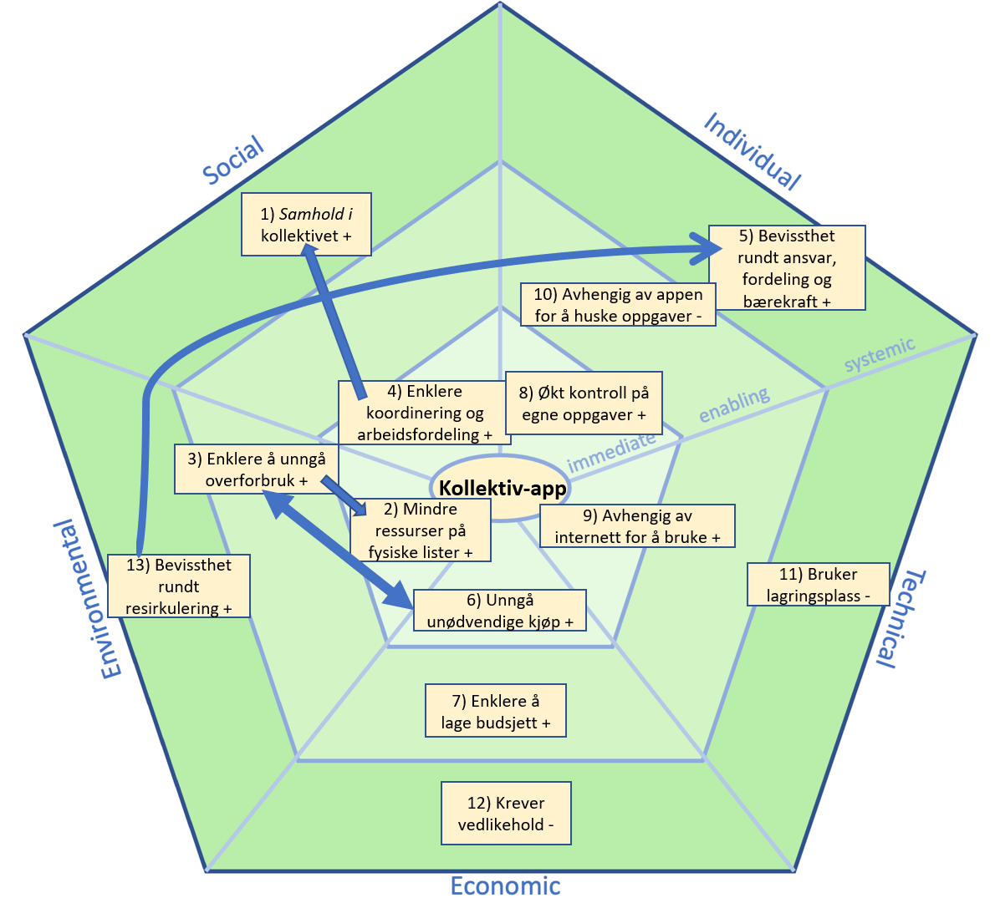

# Bærekraftsaspekter ved prosjektet

Her presenteres et bærekraftsdiagram (SusAD), utviklet med utgangspunkt i Sustainability Awareness-rammeverket (SusAF), sammen med en tilhørende tabell. Diagrammet og tabellen illustrerer de ulike bærekraftsaspektene ved appen, samt deres respektive påvirkninger. Under diagrammet og tabellen følger en beskrivelse av hver virkning og hvordan de ulike aspektene henger sammen.

### Samhold i kollektivet 

Appen styrker fellesskapet ved å gi kollektivet en felles plattform for å organisere daglige gjøremål. Samarbeidet rundt appen bidrar til å skape en bedre teamfølelse og et mer harmonisk bomiljø, der alle deltar i husholdningens ansvarsområder. 

### Mindre ressurser på fysiske lister 

Ved å digitalisere vaskeplaner og handlelister unngår man å måtte bruke papir på fysiske vaskeplaner og handlelister. Oppgaver og lister kan oppdateres og deles med alle, noe som sparer både tid og ressurser. Det er også vanskligere å miste eller ødelegge listen, siden den har blitt digitalisert.

### Enklere å unngå overforbruk 

Handlelisten gjør det lettere å ha kontroll på hva som faktisk trengs, og dermed unngå unødvendige kjøp. Dette bidrar til mindre overforbruk og sparer kollektivet for utgifter på ting man allerede har. Denne virkningen påvirker også virkning 2); mindre ressursbruk, og henger tett sammen med virkning 6); unngå unødvendige kjøp. 

### Enklere koordinering og arbeidsfordeling 

Den automatiserte rotasjonen i vaskeplanen gjør det enkelt å fordele oppgaver jevnt, og enkelt å se hvilke oppgaver man er ansvarlig for. Den aktive handlelisten og søppeltømmingsoversikten gjør det enkelt å koordinere og få oversikt over søppeltømming og handling i kollektivet. Denne virkningen har også en påvirkning på virkning 1): samhold i kollektivet, da koordinering og arbeidsfordeling i et kollektiv vil gi en viss fellesskapsfølelse. 

### Bevissthet rundt ansvar, fordeling og bærekraft 

Appen øker bevissthet rundt ansvarsfordeling og bærekraft ved å gi en tydelig struktur for avfallshåndtering og ukentlige oppgaver. Dette gjør det enklere for studentene å bidra i kollektivet, samtidig som det blir enklere å resirkulere riktig. 

### Unngå unødvendige kjøp 

Handlelisten oppdateres fortløpende, og gir studentene oversikt over hva som allerede er kjøpt, slik at de kan unngår å kjøpe mer av noe de har nok av. Dette reduserer både kostnader og matsvinn. Denne virkningen henger også tett sammen med virkning 3); enklere å unngå overforbruk.

### Enklere å lage budsjett 

Handlelisten med kjøpshistorikk gjør det enkelt å holde oversikt over felleskostnader, som matvarer og vaskeutstyr. Dette gir kollektivet en god start for å lage og følge et månedlig budsjett, noe som gir bedre økonomisk kontroll.

### Økt kontroll på egne oppgaver 

Med appen får hver beboer en tydelig oversikt over egne oppgaver og forpliktelser. Dette gir større ansvarsfølelse og gjør det enklere å holde seg oppdatert på det som må gjøres. Denne enkeltheten kommer spesielt godt med for opptatte studenter.

### Avhengig av internett for å bruke 

Appen krever internett for å kunne oppdateres i sanntid. Om internett er nede, eller man ikke har tilgang på mobildata, kan det være vanskelig å bruke appen fullt ut, noe som kan skape utfordringer i planleggingen.

### Avhengig av appen for å huske oppgaver 

Hver enkelt student kan bli for avhengige av appen for å holde styr på oppgaver og ansvar, noe som kan svekke evnen til å huske og utføre gjøremål uten digitale påminnelser videre i livet eller på andre arenaer.

### Bruker lagringsplass 

Appen trenger ledig plass på enheten som bruker den. Dataen kan variere blandt kollektivene. Mangel på lagringsplass kan være en ulempe for noen brukere.

### Krever vedlikehold 

Appen krever jevnlig vedlikehold og oppdateringer. Det innebærer at noen må gå gjennom appen for å sikre at den fungerer som den skal. Dette krever både tid og timeslønn, med mindre noen jobber frivillig.

### Bevissthet rundt resirkulering 

Med informasjon om søppelhentingstider er det mulig å danne gode resirkuleringsrutiner i kollektivet. Dette kan bidra til et mer miljøvennlig hushold, og mer bevissthet rundt resirkulering. Denne virkningen påvirker også virkning 5); den enkeltes økte bevissthet rundt blant annet bærekraft.